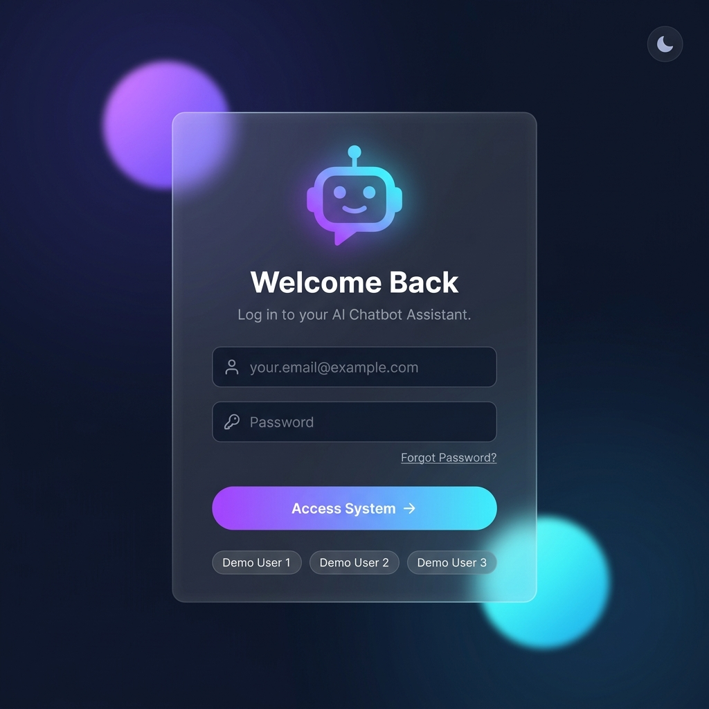
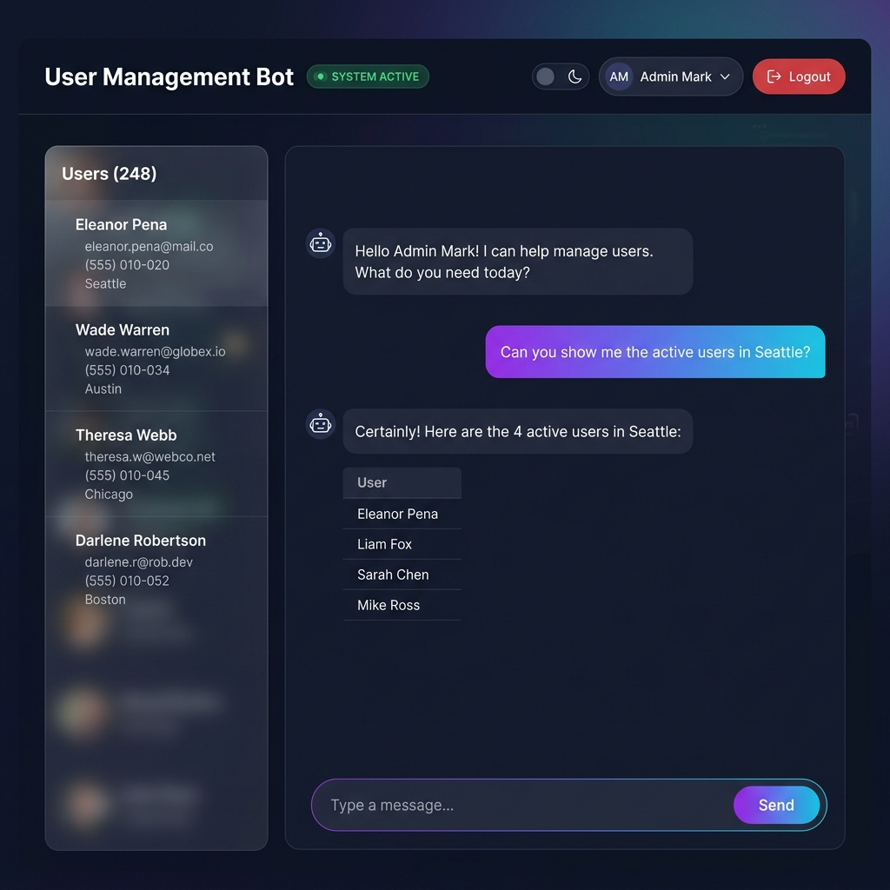
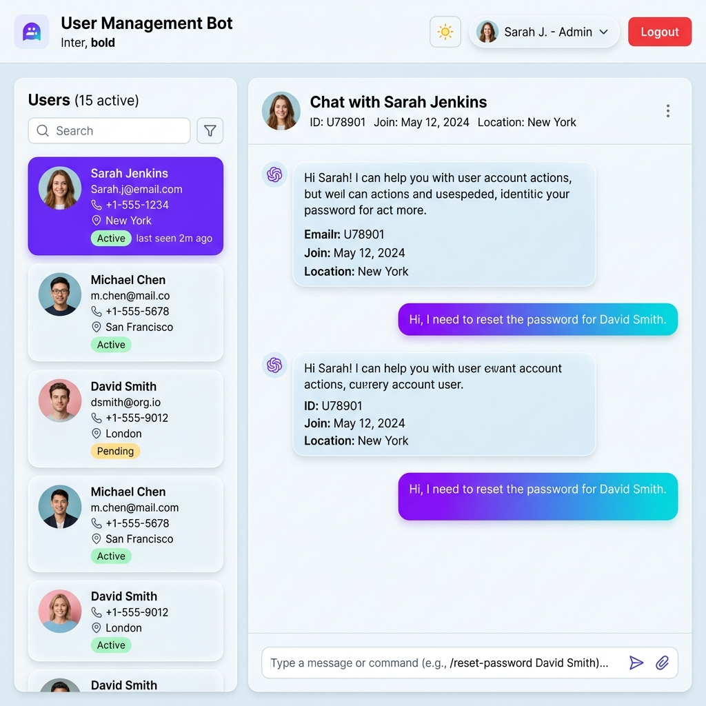

<div align="center">



# 🤖 User Management Chatbot

### *An intelligent, AI-powered user management system with natural language commands*

<br/>

[](https://python.org)
[](https://flask.palletsprojects.com)
[](https://sqlite.org)
[](LICENSE)

</div>

---

## ✨ Overview

**User Management Chatbot** is a sleek, full-stack web application that lets you manage users through natural language commands — no forms, no buttons, just type what you want done.

Built with **Flask + SQLite** on the backend and a stunning **glassmorphism UI** on the frontend, it features:
- 🌙 **Dark & Light mode** with one-click toggle
- 💬 **Natural language commands** — add, update, delete, search users
- ⚡ **Real-time sidebar** — live database view that updates on every action
- 🎨 **Premium design** — glassmorphism, micro-animations, gradient accents

---

## 🖥️ Screenshots

<table>
  <tr>
    <td align="center" width="50%">
      
      <br/><b>🌙 Dark Mode</b>
    </td>
    <td align="center" width="50%">
      
      <br/><b>☀️ Light Mode</b>
    </td>
  </tr>
</table>

---

## 🚀 Features

| Feature | Description |
|---|---|
| 🔐 **Auto Login** | Email-based authentication — no passwords needed |
| ➕ **Add Users** | Natural language: *"add user john@xyz.com with phone +92332"* |
| ✏️ **Update Users** | Natural language: *"update samanthas city to Cordoba"* |
| 🗑️ **Remove Users** | Natural language: *"remove user john@xyz.com"* |
| 📋 **List Users** | Natural language: *"show users"* |
| 👥 **Live Sidebar** | Real-time user list that syncs after every action |
| 🌙☀️ **Theme Toggle** | Instant dark/light mode — preference saved in browser |
| 📱 **Responsive** | Works on desktop, tablet, and mobile |

---

## 🛠️ Tech Stack

```
Backend  →  Python 3  +  Flask  +  SQLite3
Frontend →  HTML5  +  Vanilla CSS  +  JavaScript (ES6+)
Design   →  Glassmorphism  +  Inter & JetBrains Mono fonts
```

---

## ⚙️ Installation & Setup

### Prerequisites
- Python 3.8 or higher
- pip (Python package manager)

### 1. Clone the Repository

```bash
git clone https://github.com/saqib54/Task_chatbot-WPBrigade.git
cd Task_chatbot-WPBrigade
```

### 2. Install Dependencies

```bash
pip install flask
```

### 3. Run the App

```bash
python app.py
```

### 4. Open in Browser

```
http://127.0.0.1:5000
```

---

## 🔑 Demo Accounts

Click any demo account on the login page to auto-login:

| Name | Email |
|---|---|
| Admin (John Smith) | `jhon.smith@xyz.com` |
| Samantha | `samantha@xyz.com` |
| Alex Johnson | `alex.j@xyz.com` |

---

## 💬 Example Commands

You can type these directly into the chatbot:

```
can you add the user "john.smith@xyz.com" with phone number "+92332"
can you add user "sara@xyz.com" with phone +1234 in city London
can you update samanthas city to Cordoba
can you update john.smith@xyz.com phone to +923001234567
can you remove the user "john.smith@xyz.com"
show users
list all users
```

---

## 📁 Project Structure

```
Task_chatbot-WPBrigade/
├── app.py                    # Flask backend & API routes
├── users.db                  # SQLite database (auto-created)
├── Templates/
│   ├── login.html            # Login page
│   └── index.html            # Chat dashboard
├── static/
│   └── css/
│       └── style.css         # Full design system (dark + light mode)
├── images/
│   └── readme/               # README preview images
└── README.md
```

---

## 🎨 Design Highlights

- **Glassmorphism** — `backdrop-filter: blur()` with layered transparency
- **CSS Variables** — Full dark/light theme switching via `[data-theme]`
- **Micro-animations** — slide-in, fade, pulse, typing indicator, hover effects
- **Gradient Accent** — `#6d63ff → #06c5d9` (purple → cyan)
- **Google Fonts** — Inter (UI) + JetBrains Mono (code/emails)
- **Responsive Grid** — adapts to all screen sizes

---

## 📜 License

This project is licensed under the **MIT License** — feel free to use and modify.

---

<div align="center">

Made with ❤️ by **[saqib54](https://github.com/saqib54)** &nbsp;|&nbsp; WPBrigade Assignment

⭐ **Star this repo** if you found it useful!

</div>
